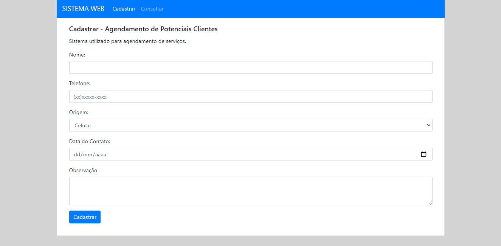
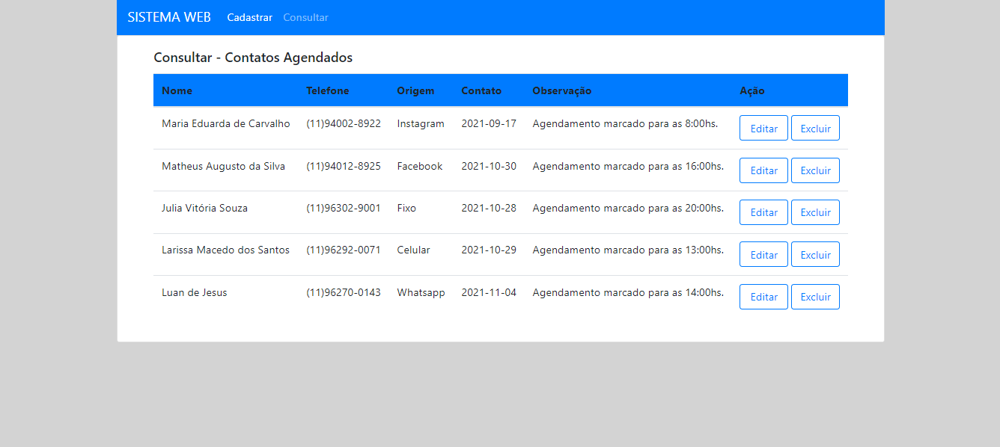
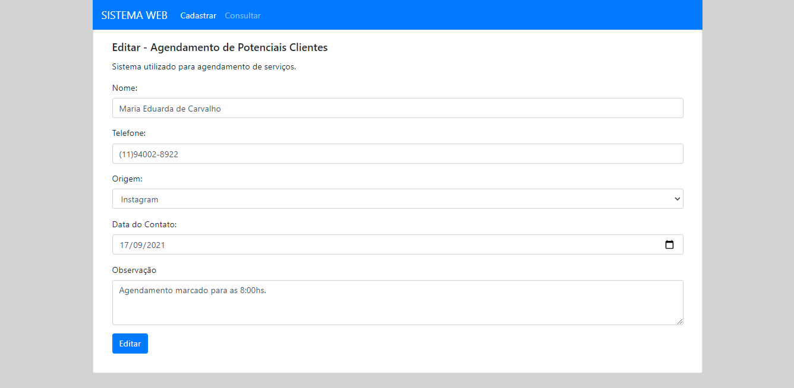
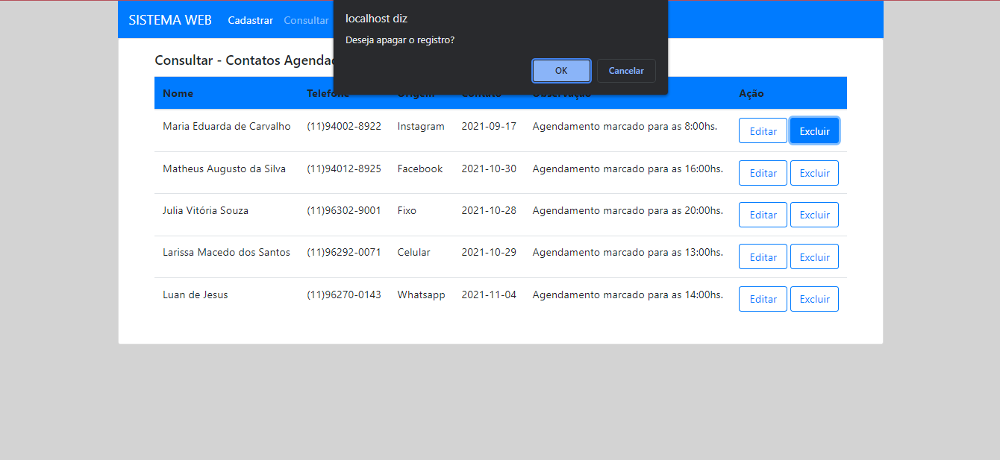

# CRUD-MVC-PHP
Crud em MVC e PHP

### Objetivo: 
>Desenvolver um sistema CRUD simples em PHP 5 ou 7 (sem frameworks) e MySQL para a administração de serviços agendados. 
>Base de Dados: phpMyAdmin

<h2>Index</h2>

<h2>Consultar</h2>

<h2>Editar</h2>

<h2>Excluir</h2>

